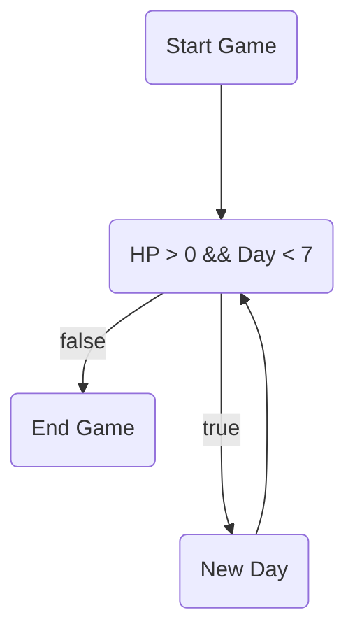

# C-Project
## C Language Project for Computer Programming
- สถานะการอยู่เกมอยู่ในป่าลึก เราต้องเอาตัวรอดจากป่าให้ได้ประมาณ7วัน ่่่่
- กดสำรวจเพื่ออออออออออออออออกไปหาทรัพยากร ในการดำรงชีวิตหรืออาจจะเหตุการณ์พิเศษเกิดขึ้นก็เป็นได้...
- ทรัพยากรในการดำรงชีวิตได้แก่ น้ำ อาหาร((ผัก,หมู,กวาง)อีเว้นในการเลือกต่อสู้หรือหนี) วัตถุดิบในการสร้างของเช่น ไม้ หิน เชือก(เถาวัน) สมุนไพร
- ทรัพยากรที่ต้องการต่อวัน ฝืน(ไม้) อาจจะมี(อาหาร(หากน้อยกว่า0เลือดจะลด) น้ำ(หากน้อยกว่า0เลือดจะลด)) หลังกินอาหารจะได้ energy
