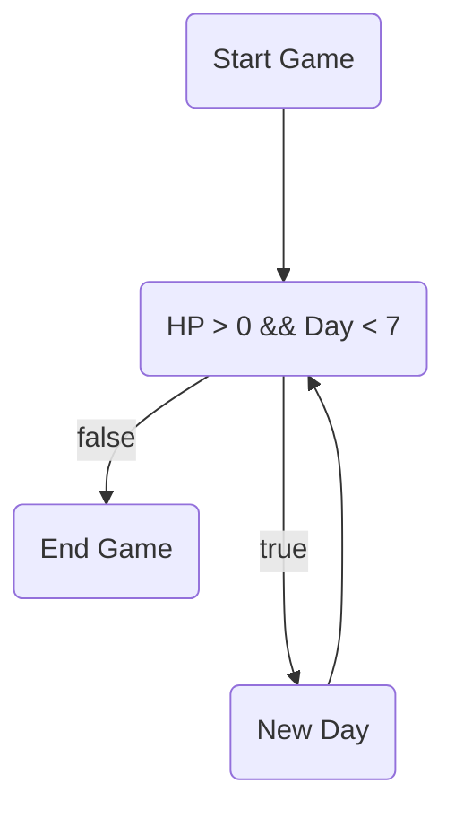

# Wild-Survivor

## สมาชิกกลุ่ม

1. นายชาติณโยดม วิบูลย์พานิช 64070021
2. นายณัฐดนัย ปลื้มใจ 64070029
3. นายธนวัฒน์ ศรีโท 64070044
4. นายวัชรวีร์ ศรีพิบูลย์ 64070101

## C Language Project for Computer Programming

## จุดประสงค์
- พวกเราสร้างเกมขึ้นมาเพื่อ ต้องการสร้างความสนุกในเวลาว่าง และต้องการพัฒนาทักษะในการเขียน code ของพวกเราให้มากขึ้น ซึ่งจะมาทำให้ได้ใช้เวลาว่างให้เกิดประโยชน์

