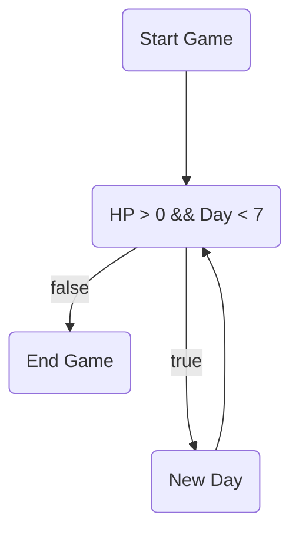

# C-Project

## สมาชิกกลุ่ม

1. นายป
2. นายณัฐดนัย ปลื้มใจ 64070029
3. นายธนวัฒน์ ศรีโท 64070044
4. นายวัชรวีร์ ศรีพิบูลย์ 64070101

## C Language Project for Computer Programming

- สถานะการอยู่เกมอยู่ในป่าลึก เราต้องเอาตัวรอดจากป่าให้ได้ประมาณ700วัน
- กดสำรวจเพื่ออออออออออออออออกไปหาทรัพยากร ในการดำรงชีวิตหรืออาจจะเหตุการณ์พิเศษเกิดขึ้นก็เป็นได้...
- ทรัพยากรในการดำรงชีวิตได้แก่ น้ำ อาหาร((ผัก,หมู,กวาง)อีเว้นในการเลือกต่อสู้หรือหนี) วัตถุดิบในการสร้างของเช่น ไม้ หิน เชือก(เถาวัน) สมุนไพร
- ทรัพยากรที่ต้องการต่อวัน ฝืน(ไม้) อาจจะมี(อาหาร(หากน้อยกว่า0เลือดจะลด) น้ำ(หากน้อยกว่า0เลือดจะลด)) หลังกินอาหารจะได้ energy
- hp หากหมด เกมจะจบลง
- energy หากหมดจะออกสำรวจไม่ได้
- สมุนไพร บางสมุนไพรมีผลในการเพิ่ม hp บางสมุนไพรมีผลเพิ่ม energy
- การต่อสู้ เป็นแบบตัวเลือกสู้หรือหนึเท่านั้น หากมีอุปกรณ์ช่วยต่อสู้จะทำให้ได้เปรียบ หากหนีจากสิงโต จะคำนวณจาก energy ที่มีในการหนี หากหมดระหว่างหนี ตายแน่ สู้กับนักล่าหากมีอาวุธอยู่กับตัวจะมีโอกาศชนะมากกว่ามือเปล่า

