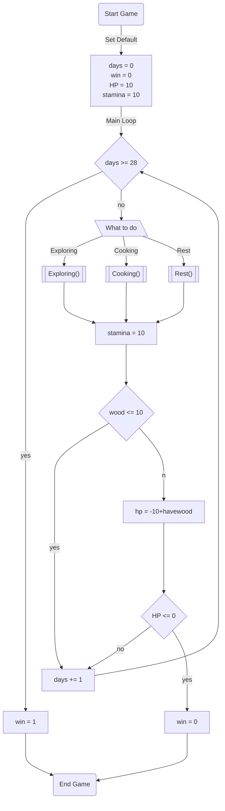

# game design document

## Introduction

- Game Concept เป็นเกมเอาชีวิตรอดในป่า ที่เล่าเรื่องราวผ่านตัวละครเป็นมุมมองบุคคลที่1
- หมวดหมู่เกม เกมเอาชีวิตรอด
- เนื้อเรื่อง เครื่องบินที่เราโดยสารอยู่เกิดขัดข้องทำให้เครื่องบินตก แต่โชคดีที่เรารอดมาได้ และเราได้ติดต่อวิทยุของเครื่องบินเพื่อของความช่วยเหลือ หลังจากติดต่อกับหน่วยช่วยเหลือได้ความว่า เขาจะมาถึงที่เกิดเหตุใน4สัปดาห์ และเราต้องอยู่รอดให้ได้จนกว่าหน่วยกู้ภัยจะมาถึง
- บรรยายกาศของเกม จะเป็นธีมป่าลึก

## Game Structure

- โหมดเกมที่ผู้เล่นสามารถเล่นได้ โหมดเนื้อเรื่องเท่านั้น
- Engagement เราผ่าน command line ของภาษา C
- การเล่น เป็นเกมเล่นคนเดียว
- วิธีการเล่น ตัวเกมรับคำสั่งจาก keyboard เพื่อให้เลือกทางเลือกหรือทำ action บางอย่างในสถาะการนั้นๆ

## Graphics

- มุมมองของเกม เป็นบุคคลที่ 1
- สไตล์กราฟฟิก เป็น ascii กราฟฟิก
  
## Platform

- PC

## Development System

- VScode & Codebox

## Game play

- Character เราจะได้สวมบทบาทเป็น ชายที่ชื่อว่า Jack มีความรู้เกี่ยวกับป่าและสกิลเอาตัวรอดสูง
- Story เครื่องบินที่เราโดยสารอยู่เกิดขัดข้องทำให้เครื่องบินตก แต่โชคดีที่เรารอดมาได้ และเราได้ติดต่อวิทยุของเครื่องบินเพื่อของความช่วยเหลือ หลังจากติดต่อกับหน่วยช่วยเหลือได้ความว่า เขาจะมาถึงที่เกิดเหตุใน4สัปดาห์ และเราต้องอยู่รอดให้ได้จนกว่าหน่วยกู้ภัยจะมาถึง
- Objective เป้าหมายของการชนะคือ การเอาตัวรอดให้ได้ตามวันที่กำหนด  การแพ้ในเกม HP ของเราลดจนเหลือ 0
- Core Game Mechanic เราต้องสำรวจป่าเพื่อหาของมาให้เราไม่อดตาย โดยการสำรวจแต่ละครั้งเราจะถูกสุ่มของที่จะได้ และจะได้ไอเทมบางอย่างเยอะเป็นพิเศษขึ้นอยู่กับอีเว้น และผู้เล่นต้องจัดการกับทรัพยากรรที่มีเพื่อให้ถึงจุดหมายของเกม
- Level Design map สุ่มจะเจอ map ดังต่อไปนี้ ป่า(60%), แม่น้ำ(20%), ป่ารก(20%)
- Progression เราจะใส่ระบบสุ่มอีเว้น ดังต่อไปนี้ เจอกวาง(เจอ 20%)(win_rate 75%), เจองู(เจอ 15%)(win_rate 50%), เจอปลา(เจอ 100%)(win_rate 50%) ทำให้ความรู้ในการเล่นแต่ละรอบต่างกันเพราะสิ่งที่เจออาจจะต่างกัน
- Enemy มี 2 แบบ คือสัตร์กินพืชและสัตว์ดุร้าย โดยที่สัตว์กินพืชจะไม่ทำร้ายเรามันมักจะหนี ส่วนสัตว์ดุร้ายจะทำร้ายเราและเราต้องหนีหรือไม่ก็ต้องสู้กลับ
- Game Flow
  
## Flowchart

### energy bur

- HP บอกเลือดที่มีอยู่ตอนนี้
- บอกพลังงานที่เหลืออยู่ในการสำรวจ หากลดจนเหลือน้อยกว่า 0 จะไม่สามรถสำรวจต่อได้

### Item in game

- food อาหารจำพวก ผัก(HP+) เนื้อ(HP+) กินที่แค้มป์
- water น้ำจากแม่น้ำ(Stamina+++) น้ำยังกินไม่ได้ต้องต้มก่อน

### combat

- สู้ สุ่มว่าตีหรือไม่โดน โดนคือชนะ ไม่โดนคือ เลือดลด
- หนี สุ่มว่าหนีได้ไม่ได้ หนีได้คือไม่ต้องสู้ หนีไม่ได้คือ เลือดลดและสู้ต่อ

### explore

- ทำการสุ่มเหตุการณ์ที่จะเกิดขึ้นหากผู้เล่นเลือกที่จะเดินทางต่อ
- หลังเลือกเส้นทางแล้วก็จะทำการสำรวจพื้นที่ในทางนั้น จากนั้นจะขึ้นรายละเอียดของที่ได้รับและลด Stamina ลง และหลังจากขึ้นรายละเอียดของที่ได้มาแล้ว มีโอกาสเจอ อีเว้น เช่น เจอกวาง,สัตว์ร้าย,แหล่งน้ำที่มีปลา
- ของที่ได้รับจากการสำรวจ ไม้(1-2ชิ้น) ผัก(0-2ชิ้น)
- map จะมีแบบป่าไม้ แม่น้ำ(น้ำ,ปลา) ป่ารก(มีโอกาสเจอผักมาก)

## Team

1. นายชาติณโยดม วิบูลย์พานิช 64070021
2. นายณัฐดนัย ปลื้มใจ 64070029
3. นายธนวัฒน์ ศรีโท 64070044
4. นายวัชรวีร์ ศรีพิบูลย์ 64070101

## Timeline

- วันเริ่ม Project 14 เมษายน
- ระยะเวลาการพัฒนาเกม สอง-สามอาทิตย์
