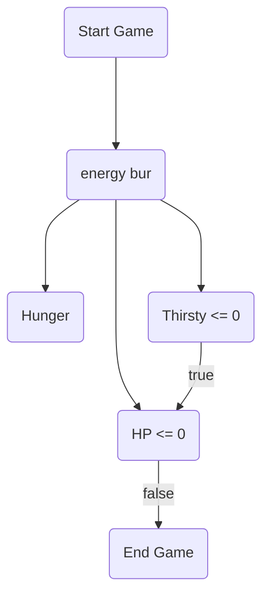

# game design document

## Introduction
- Game Concept เป็นเกมเอาชีวิตรอดในป่า ที่เล่าเรื่องราวผ่านตัวละครเป็นมุมมองบุคคลที่1
- หมวดหมู่เกม เกมเอาชีวิตรอด
- เนื้อเรื่อง เครื่องบินที่เราโดยสารอยู่เกิดขัดข้องทำให้เครื่องบินตก แต่โชคดีที่เรารอดมาได้ และเราได้ติดต่อวิทยุของเครื่องบินเพื่อของความช่วยเหลือ หลังจากติดต่อกับหน่วยช่วยเหลือได้ความว่า เขาจะมาถึงที่เกิดเหตุใน2สัปดาห์ และเราต้องอยู่รอดให้ได้จนกว่าหน่วยกู้ภัยจะมาถึง
- บรรยายกาศของเกม จะเป็นธีมป่าลึก

## Game Structure
- โหมดเกมที่ผู้เล่นสามารถเล่นได้ โหมดเนื้อเรื่องเท่านั้น
- Engagement เราผ่านcommand line ของภาษา C
- การเล่น เป็นเกมเล่นคนเดียว
- วิธีการเล่น ตัวเกมรับคำสั่งจาก keyboard เพื่อให้เลือกทางเลือกหรือทำ action บางอย่างในสถาะการนั้นๆ

## Graphics & Sound
- มุมมองของเกม เป็นบุคคลที่ 1
- สไตล์กราฟฟิก เป็น ascii กราฟฟิก
- Animation อาจมีเล็กน้อย เช่นเดินทางเปลี่ยนโซน
- Music ถ้าใส่มาได้ก็จะมี
## Platform
- PC

## Development System
- VScode & Codebox

## Game play
- Character เราจะได้สวมบทบาทเป็น ชายที่ชื่อว่า Jack มีความรู้เกี่ยวกับป่าและรู้เรื่องคุณของสมุนไพรบางชนิด
- Story เครื่องบินที่เราโดยสารอยู่เกิดขัดข้องทำให้เครื่องบินตก แต่โชคดีที่เรารอดมาได้ และเราได้ติดต่อวิทยุของเครื่องบินเพื่อของความช่วยเหลือ หลังจากติดต่อกับหน่วยช่วยเหลือได้ความว่า เขาจะมาถึงที่เกิดเหตุใน2สัปดาห์ และเราต้องอยู่รอดให้ได้จนกว่าหน่วยกู้ภัยจะมาถึง เราได้ตัดสินใจเก็บสัมภาระออกจากเครื่องบิน ไปตั้งที่พักห่างจากเครื่องบิน 1-2 กิโล เพื่อความปลอดภัย 
- Objective เป้าหมายของการชนะคือ การเอาตัวรอดให้ได้ตามวันที่กำหนด เมื่อถึงวันที่กำหนดต้องเดินทางไปที่จุดนั้นพบเพื่อออกจากป่า การแพ้ในเกม HPของเราลดจนเหลือ 0 หรือ ไม่ได้ไปตามจุดนั้นพบในวันนีัน
- Core Game Mechanic เราต้องสำรวจป่าเพื่อหาของมาให้เราไม่อดตาย โดยการสำรวจแต่ละครั้งเราจะถูกสุ่มของที่จะได้ และจะได้ไอเทมบางอย่างเยอะเป็นพิเศษขึ้นอยู่กับอีเว้น และผู้เล่นต้องจัดการกับทรัพยากรรที่มีเพื่อให้ถึงจุดหมายของเกม
- Level Design map อาจจะใหญ่ประมาณ 20*20
- Progression เราจะใส่ระบบสุ่มอีเว้น ทำให้ความรู้ในการเล่นแต่ละรอบต่างกันเพราะสิ่งที่เจออาจจะต่างกัน
- Enemy มี 2 แบบ คือสัตร์กินพืชและสัตว์กินเนื้อ โดยที่สัตว์กินพืชจะไม่ทำร้ายเรามันมักจะหนี ส่วนสัตว์กินเนื้อจะทำร้ายเราและเราต้องหนีหรือไม่ก็ต้องสู้กลับ
- Game Flow 

- UI Flow

### energy bur
- HP บอกเลือดที่มีอยู่ตอนนี้
- Hunger บอกความหิว หากลดจนเหลือน้อยกว่า 0 จะเสีย HP ต่อ action
- Thirsty บอกความกระหายน้ำ หากลดจนเหลือน้อยกว่า 0 จะเสีย HP ต่อ action
- Stemina บอกพลังงานที่เหลืออยู่ในการสำรวจ หากลดจนเหลือน้อยกว่า 0 จะไม่สามรถสำรวจต่อได้

### Item in game
- food อาหารจำพวก ผัก(H+ T+ S+) เนื้อ(H+++ T- S++)(HP+) ผลไม้(H+ T++ S++) เห็ด(H+ T+ S++) มะพร้าว(H+ T++ S+)
- water น้ำจากแม่น้ำ แอ่งน้ำ(H0 T+++ S0) น้ำยังกินไม่ได้ต้องต้มก่อน
- herb สมุนไพร มีแบบเพิ่มเลือด(HP+++) เพิ่มพลังงาน(H0 T0 S+++)
- equipment มีดล่าสัตว์ เบ็ตตกปลา กระติกกะลามะพร้าว หอก ธนู
- Craft material ไม้ หิน กะละมะพร้าว เถาวัน 

### combe
- ต่อสู้กับสัตว์กินพืช หากเราโจมตีใส่ กวาง หากไม่สามารถฆ่าได้ใน 1-2 action มันจะหนี
- ต่อสู้กับปลา เอาหอกทิ่มที่ปลาจะมีโอกาศได้มากว่า อาวุธชนิดอื่นมาก
- ต่อสู้กับสัตว์กินเนื้อ หากเราโจมตีใส่ เสือ มันจะโจมตีกลับและผู้เล่นจะเสียลด หากเราเสียเลือดจนหมดในการต่อสู้จะตายทันที หากไม่ต้องการสู้ก็ต้องหนี
- การหนี หารวิ่งหนีจะเสีย Stemina หากหนีพ้นก็ไม่เป็นไร แต่หาก Stemina หมดและยังหนีไม่พ้น เราจะตายทันที
### explore
- การสำรวจจะให้ตัวเลือกสามเส้นทาง คือ ข้างหน้า ทางซ้าย ทางขวา
- หลังเลือกเส้นทางแล้วก็จะทำการสำรวจพื้นที่ในทางนั้น จากนั้นจะขึ้นรายละเอียดของที่ได้รับและลด Stemina ลง และหลังจากขึ้นรายละเอียดของที่ได้มาแล้ว มีโอกาสเจอ อีเว้น เช่น เจอกวาง,หมูป่า,เสือ,แหล่งน้ำที่มีปลา
- ของที่ได้รับจากการสำรวจ ไม้(0-2ชิ้น) หิน(0-2ชิ้น) กะละมะพร้าว(0-1ชิ้น) เถาวัน(0-2ชิ้น) ผัก(0-2ชิ้น) เห็ด(0-1ชิ้น) ผลไม้(0-1ชิ้น) มะพร้าว(0-1ชิ้น)
- map จะมีแบบป่าไม้ แอ่งน้ำ(น้ำ,ปลา) แม่น้ำ(น้ำ,ปลา) ป่ารก(มีโอกาสเจอ ผัก ผลไม้ เห็ด มาก)

## Team
1. นายนายชาติณโยดม วิบูลย์พานิช 64070021
2. นายณัฐดนัย ปลื้มใจ 64070029
3. นายธนวัฒน์ ศรีโท 64070044
4. นายวัชรวีร์ ศรีพิบูลย์ 64070101

## Timeline
- วันเริ่ม Project 14 เมษยน
- ระยะเวลาการพัฒนาเกม สอง-สามอาทิตย์
